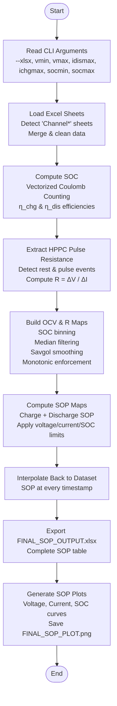

# 🔋 SOP Estimation for INR18650‑20R Battery Cell
**A Complete State of Power (SOP) Estimation Framework Using HPPC Pulse Resistance, OCV Mapping & Coulomb Counting**  
**Author:** *Shrihariprasath Basuvaiyan*

---

# 📘 Introduction

This project provides a comprehensive **State of Power (SOP)** estimation pipeline for the **Samsung INR18650‑20R lithium‑ion battery cell** using real experimental data.  
The methodology is widely used in EV Battery Management Systems (BMS) for:

✅ Power limit calculation  
✅ Fast charging control  
✅ Safety supervision  
✅ Torque/power capability estimation  

The system performs:

- ✅ **State of Charge (SOC)** estimation using vectorized Coulomb counting  
- ✅ **OCV–SOC mapping** using rest-state voltage data  
- ✅ **Internal resistance (R–SOC mapping)** using HPPC pulse extraction  
- ✅ **Charge & Discharge SOP estimation** using physical constraints  
- ✅ **Plot generation + Excel and PKL exports**  
- ✅ **Validation with error reporting**  

This single README includes:

✅ Full methodology  
✅ Complete workflow diagram  
✅ All equations  
✅ Full feature description  
✅ Output explanation  
✅ Folder structure  

All in **one single file**.

---
# ✅ Key Features

- Automatically detects all `Channel_*` sheets in Excel input  
- Merges and cleans cell measurement data  
- Accurate SOC estimation using Coulomb counting  
- HPPC pulse-based internal resistance extraction  
- Savitzky–Golay smoothing for clean OCV and R maps  
- Monotonic OCV enforcement (physical requirement)  
- SOP estimation with configurable voltage/current/SOC limits  
- Detailed SOP validation report  
- Exports Excel files, PNG plots, and pickled OCV/R maps  

---
# 📂 Input Excel Format

Your Excel workbook must contain:

```
Channel_1
Channel_2
Channel_3
...
```

Each sheet must contain the following columns:
```
Test_Time(s)
Current(A)
Voltage(V)
Charge_Capacity(Ah)
Discharge_Capacity(Ah)
```

---
# ▶️ Running the Script

```bash
python sop_estimation.py     --xlsx data.xlsx     --vmin 2.5 --vmax 4.2     --idismax 10 --ichgmax 5     --socmin 0.1 --socmax 0.9
```

---
# ✅ CLI Arguments

| Argument | Description |
|----------|-------------|
| `--xlsx` | Input Excel file path |
| `--vmin` | Minimum discharge voltage limit |
| `--vmax` | Maximum charge voltage limit |
| `--idismax` | Maximum discharge current |
| `--ichgmax` | Maximum charge current |
| `--socmin` | Lower usable SOC boundary |
| `--socmax` | Upper usable SOC boundary |

---
# 📊 Full SOP Estimation Workflow



---
# 🧠 Detailed Methodology (Aligned with Python Script)

## ✅ 1. Loading & Merging Input Sheets
- Loads all sheets with prefix `Channel*`  
- Converts numeric columns  
- Removes invalid values  
- Sorts by timestamp  
- Adds metadata (`Sheet`, `Sample_ID`)  

## ✅ 2. SOC Estimation (Coulomb Counting)
Equation:

\[
SOC = SOC_0 - \int rac{I(t) \cdot \eta}{C_{nominal}} dt
\]

- `I_raw = -Current(A)` ensures discharge is negative  
- Charge efficiency = 0.99  
- Discharge efficiency = 1.00  
- Output SOC is clipped between 0 and 1  

## ✅ 3. HPPC Pulse Resistance Extraction
- Detect rest intervals (`|I| < 0.02A`)  
- Detect pulse events (`|I| > 0.5A`)  
- Match pulse → nearest preceding rest point  
- Resistance:

\[
R = rac{V_{pulse} - V_{rest}}{I_{pulse}}
\]

- Reject unrealistic values (`0 < R < 0.5Ω`)  

Outputs:
```
SOC
OCV
R
```

## ✅ 4. OCV–SOC & R–SOC Map Construction
- SOC binning (100 bins)  
- Median filtering  
- 200-point interpolation  
- Savitzky–Golay smoothing  
- Enforce monotonic OCV:

\[
OCV[i] = \max(OCV[0:i])
\]

- Clamp R to avoid division by zero  

Outputs:
- `soc_grid`
- `OCV_map`
- `R_map`

## ✅ 5. SOP Calculation
### Discharge SOP
\[
I_{dis} = rac{OCV - V_{min}}{R}
\]
\[
P_{dis} = V_{min} \cdot I_{dis}
\]

### Charge SOP
\[
I_{chg} = rac{V_{max} - OCV}{R}
\]
\[
P_{chg} = V_{max} \cdot I_{chg}
\]

### Enforced limits:
- Voltage limits  
- Current limits  
- SOC window  
- No negative currents  

## ✅ 6. Interpolating SOP Back to Full Dataset
Adds new columns:
```
SOP_Discharge(W)
SOP_Charge(W)
```

## ✅ 7. Output Exports
Saved under `outputs/`:

### ✅ `FINAL_SOP_OUTPUT.xlsx`
Includes:
- Voltage  
- Current  
- SOC  
- SOP_Discharge(W)  
- SOP_Charge(W)  

### ✅ `sop_maps.pkl`
```python
{
  "soc": soc_grid,
  "ocv": OCV_map,
  "r": R_map
}
```

### ✅ `FINAL_SOP_PLOT.png`
Contains: SOP vs Voltage, Current, SOC

### ✅ `SOP_VALIDATION_OUTPUT.xlsx`
SOP recomputed for error comparison

### ✅ `SOP_VALIDATION_REPORT.txt`
Statistics (RMSE, MAE, bias)

---
# 📁 Folder Structure
```
project/
│── sop_estimation.py
│── data.xlsx
│── outputs/
│   │── FINAL_SOP_OUTPUT.xlsx
│   │── FINAL_SOP_PLOT.png
│   │── SOP_VALIDATION_OUTPUT.xlsx
│   │── SOP_VALIDATION_REPORT.txt
│   │── sop_maps.pkl
│── README.md
```

---
# ✅ Future Enhancements
- Temperature‑dependent mapping  
- ECM modeling (1RC/2RC)  
- EKF/UKF SOC estimation  
- Real-time BMS firmware integration  
- Automated HPPC pulse detection  

---
# 📜 License
For **research and educational use only**.
